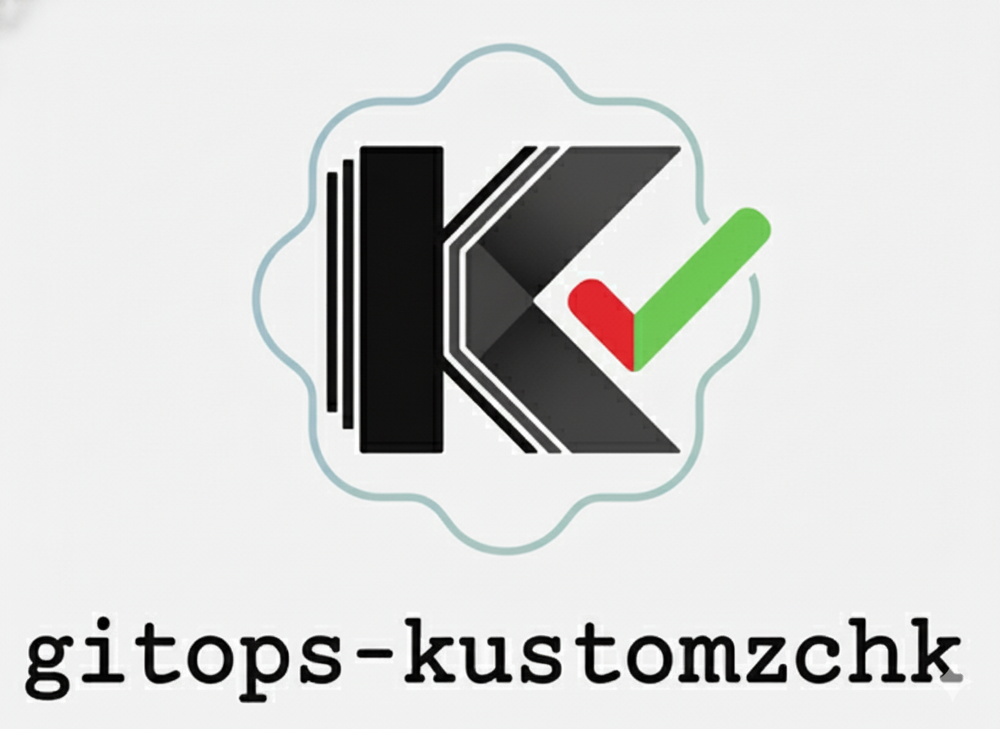
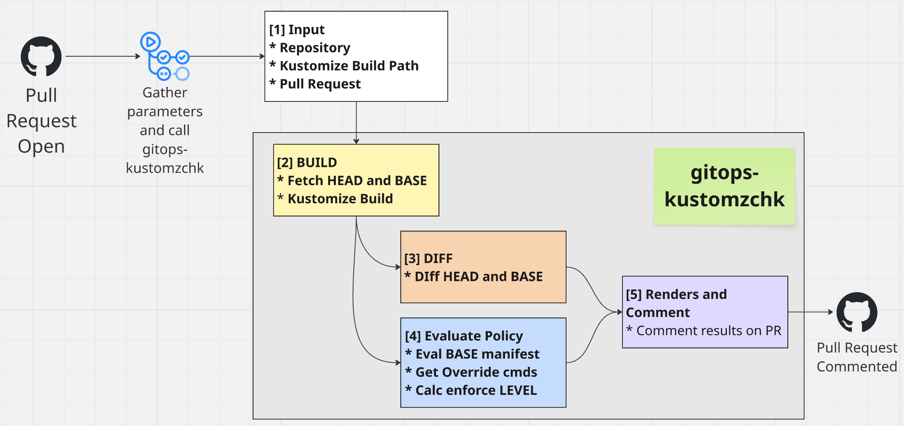

# gitops-kustomzchk

<p align="center">
  
</p>

GitOps policy enforcement tool for Kubernetes manifests managed with Kustomize.


## Overview

`gitops-kustomzchk` is designed to run in GitHub Actions CI on Pull Requests for GitOps Kubernetes manifest workflows. It sequentially builds Kubernetes manifest changes with Kustomize, evaluates them against OPA policies, provides detailed reports, and can comment on GitHub PRs.

<p align="center">
  
</p>


## Requirements

- Go 1.22+
- `kustomize` binary in PATH
- `conftest` binary in PATH (for OPA policy evaluation)
- GitHub token with PR comment permissions (for CI mode)

## Quick Start

### GitHub Actions (Recommended)

Copy one of the sample workflows to your GitOps repository:

```bash
# Copy workflow to your repo
cp sample/github-actions/gitops-policy-check-multi-env.yml \
   .github/workflows/gitops-policy-check.yml
```

See [sample/github-actions/README.md](./sample/github-actions/README.md) for detailed setup instructions.

### CLI Usage

The tool supports two modes: **dynamic paths** (flexible, recommended) and **legacy mode** (backward compatible).

#### Dynamic Path Mode (Recommended)

Use variable-based path templates for flexible overlay structures:

```bash
# GitHub mode - Dynamic paths
gitops-kustomzchk \
  --run-mode github \
  --gh-repo owner/repo \
  --gh-pr-number 123 \
  --kustomize-build-path "services/[SERVICE]/clusters/[CLUSTER]/[ENV]" \
  --kustomize-build-values "SERVICE=my-app;CLUSTER=alpha,beta;ENV=stg,prod" \
  --policies-path ./policies \
  --templates-path ./templates

# Local mode - Dynamic paths with separate before/after
gitops-kustomzchk \
  --run-mode local \
  --lc-before-kustomize-build-path "./before/services/[SERVICE]/[CLUSTER]/[ENV]" \
  --lc-after-kustomize-build-path "./after/services/[SERVICE]/[CLUSTER]/[ENV]" \
  --kustomize-build-values "SERVICE=my-app;CLUSTER=blue,green;ENV=stg,prod" \
  --policies-path ./policies \
  --templates-path ./templates \
  --output-dir ./output \
  --enable-export-report true
```

**Variable Syntax:**
- Use `[VARIABLE]` placeholders in path templates
- Define values as `KEY=val1,val2;KEY2=val3,val4`
- Generates all combinations in specified order (e.g., `blue/stg`, `blue/prod`, `green/stg`, `green/prod`)

#### Legacy Mode (Backward Compatible)

<details>  <summary> Legacy commands </summary>

Fixed service + environments structure:

```bash
# GitHub mode - Legacy
gitops-kustomzchk \
  --run-mode github \
  --gh-repo owner/repo \
  --gh-pr-number 123 \
  --service my-app \
  --environments stg,prod \
  --manifests-path ./services \
  --policies-path ./policies

# Local mode - Legacy  
gitops-kustomzchk \
  --run-mode local \
  --service my-app \
  --environments stg,prod \
  --lc-before-manifests-path ./before/services \
  --lc-after-manifests-path ./after/services \
  --policies-path ./policies \
  --output-dir ./output \
  --enable-export-report true
```

</details>

**Additional Flags:**
- `--enable-export-performance-report`: Export OpenTelemetry performance metrics
- `--git-checkout-strategy [sparse|shallow]`: Optimize Git checkout (default: `sparse`)
- `--fail-on-overlay-not-found`: Fail if overlay doesn't exist (default: skip missing overlays)
- `--debug`: Enable debug logging

### Dynamic Path Use Cases

Dynamic paths support various overlay structures:

**Multi-Cluster + Multi-Environment:**
```bash
--kustomize-build-path "services/[SERVICE]/clusters/[CLUSTER]/[ENV]"
--kustomize-build-values "SERVICE=api;CLUSTER=us-east,eu-west;ENV=stg,prod"
# Generates: api/us-east/stg, api/us-east/prod, api/eu-west/stg, api/eu-west/prod
```

**Region + Tenant + Environment:**
```bash
--kustomize-build-path "apps/[APP]/[REGION]/[TENANT]/[ENV]"
--kustomize-build-values "APP=frontend;REGION=us,eu;TENANT=acme,globex;ENV=dev,prod"
# Generates: frontend/us/acme/dev, frontend/us/acme/prod, frontend/us/globex/dev, ...
```

**Simple Service + Environment (equivalent to legacy):**
```bash
--kustomize-build-path "services/[SERVICE]/environments/[ENV]"
--kustomize-build-values "SERVICE=my-app;ENV=stg,prod"
# Generates: my-app/stg, my-app/prod
```

## 📁 Project Structure

```
.
├── src/
│   ├── cmd/gitops-kustomzchk/  # CLI entry point
│   ├── pkg/                     # Core packages
│   │   ├── diff/                # Manifest diffing
│   │   ├── github/              # GitHub API client & sparse checkout
│   │   ├── kustomize/           # Kustomize builder
│   │   ├── models/              # Data models for reports & configs
│   │   ├── pathbuilder/         # Dynamic path generation with variables
│   │   ├── policy/              # Policy evaluation (OPA/Conftest)
│   │   ├── template/            # Markdown templating
│   │   └── trace/               # Performance tracing with OpenTelemetry
│   ├── internal/
│   │   └── runner/              # GitHub & Local runners
│   └── templates/               # Default markdown templates
├── sample/                      # Example policies & manifests
│   ├── github-actions/          # Sample workflows
│   ├── k8s-manifests/           # Sample Kubernetes manifests
│   └── policies/                # Sample OPA policies
├── test/                        # Test data & System Integration Tests
│   ├── ut_local/                # Local mode legacy tests
│   ├── ut_local_dynamic/        # Local mode dynamic path tests
│   └── ut_github/               # GitHub mode tests (legacy + dynamic)
├── docs/                        # Documentation
│   ├── ARCHITECTURE_v0.2.md     # Architecture overview
│   ├── DESIGN_DYNAMIC_PATH_v0.5.md  # Dynamic path design
│   └── TEMPLATE_VARIABLES.md    # Template reference
├── go.mod                       # Go module definition
└── Makefile                     # Build automation
```

## Template Customization

The tool supports custom markdown templates for GitHub comments. Templates use Go's `text/template` syntax with rich data structures.

### Quick Template Examples

```go
// Dynamic paths - Access overlay keys
{{range .OverlayKeys}}
  Overlay: {{.}}
{{end}}

// Access parsed variable values (dynamic mode)
{{range $key, $values := .ParsedKustomizeBuildValues}}
  {{$key}}: {{join $values ", "}}
{{end}}

// Legacy mode - Service and environments
{{.Service}} - {{range .Environments}}{{.}} {{end}}

// Timestamp formatting
{{.Timestamp.Format "2006-01-02 15:04:05 UTC"}}

// Iterate over manifest changes (preserves order)
{{range .OverlayKeys}}
  {{$overlay := .}}
  {{$diff := index $.ManifestChanges $overlay}}
  ### {{$overlay}}: {{$diff.LineCount}} lines
{{end}}

// Policy status by overlay
{{range .OverlayKeys}}
  {{$summary := index $.PolicyEvaluation.EnvironmentSummary .}}
  {{if $summary.PassingStatus.PassBlockingCheck}}✅{{else}}❌{{end}} {{.}}
{{end}}
```

See [docs/TEMPLATE_VARIABLES.md](./docs/TEMPLATE_VARIABLES.md) for complete reference.

## Policy Configuration

Policies are defined in `compliance-config.yaml` with support for:

- **Enforcement Levels**: BLOCKING, WARNING, RECOMMEND
- **Time-based Enforcement**: Policies can change levels over time
- **Override Support**: Allow policy bypass via PR comments
- **External Links**: Link to policy documentation for easy reference

### Example Policy Configuration

```yaml
policies:
  service-high-availability:
    name: Service High Availability
    description: Ensures deployments meet HA criteria
    type: opa
    filePath: ha.rego
    externalLink: https://docs.example.com/policies/high-availability  # Optional
    
    enforcement:
      inEffectAfter: 2025-10-01T00:00:00Z
      isWarningAfter: 2025-11-01T00:00:00Z
      isBlockingAfter: 2025-12-01T00:00:00Z
      override:
        comment: "/override-ha"
```

### Policy Report Features

- **Policy Evaluation Matrix**: Comprehensive table showing all policies with enforcement levels
- **Detailed Failure Reports**: Organized by enforcement level (BLOCKING, WARNING, RECOMMEND)
- **External Links**: Clickable policy names in the matrix that link to documentation
- **Pass/Fail Status**: Clear indicators for each environment

## Recent Updates

### v0.5.0 - Dynamic Path Support

- **🔀 Dynamic Kustomize Paths** (#106): 
  - Variable-based path templates with `[VARIABLE]` syntax
  - Support for complex overlay structures (multi-cluster, multi-region, etc.)
  - Cartesian product generation for all path combinations
  - Deterministic ordering based on flag specification
  - Separate before/after paths for local mode
  
- **📊 Enhanced Reporting**:
  - `OverlayKeys` field for flexible overlay identification
  - `ParsedKustomizeBuildValues` in report JSON for template access
  - Dynamic policy evaluation tables that adapt to any number of overlays
  - Ordered manifest changes and policy results

- **⚡ Performance Improvements**:
  - Smart base path extraction for sparse checkout
  - Optimized path combination generation

### v0.1.0 - v0.4.0 Features

- **Smart Diff Artifacts** (#3): Diffs >10k chars automatically uploaded as GitHub artifacts
- **System Integration Tests** (#2): Automated testing for local mode with baseline comparison
- **Clean Diff Output** (#4): Kustomize stderr warnings no longer pollute diff output
- **Enhanced Policy Matrix** (#5): Added Level column and external link support
- **Policy Detail Improvements**: Only failed policies shown in details section
- **Performance Tracing**: Optional OpenTelemetry-based performance reports
- **Deterministic Policy Ordering**: Policy evaluation results follow `compliance-config.yaml` order

## Documentation

- [sample/github-actions/README.md](./sample/github-actions/README.md) - **GitHub Actions setup guide**
- [docs/ARCHITECTURE_v0.2.md](./docs/ARCHITECTURE_v0.2.md) - High-level architecture and use cases
- [docs/DESIGN_sonnet.md](./docs/DESIGN_sonnet.md) - Detailed design and implementation specs
- [docs/DESIGN_DYNAMIC_PATH_v0.5.md](./docs/DESIGN_DYNAMIC_PATH_v0.5.md) - **Dynamic path feature design**
- [docs/TEMPLATE_VARIABLES.md](./docs/TEMPLATE_VARIABLES.md) - **Template variables and functions reference**
- [docs/GIT_CHECKOUT_STRATEGY.md](./docs/GIT_CHECKOUT_STRATEGY.md) - Git checkout optimization strategies

## Development

```bash
# Clone the repo
git clone https://github.com/nvatuan/gitops-kustomzchk.git
cd gitops-kustomzchk

# Build
make build

# Run tests
make test

# Run linter
make lint

# Local testing mode (dynamic paths)
make run-local

# System Integration Tests
make sit-test-local        # Legacy mode test
cd test/ut_local_dynamic && ./run_test.sh  # Dynamic path test

# GitHub integration tests
# See .github/workflows/test-github-integration.yml
```

### Running with Dynamic Paths

See `test/ut_local_dynamic/run_test.sh` for a complete example:

```bash
./bin/gitops-kustomzchk \
  --run-mode local \
  --lc-before-kustomize-build-path "test/before/[SERVICE]/[CLUSTER]/[ENV]" \
  --lc-after-kustomize-build-path "test/after/[SERVICE]/[CLUSTER]/[ENV]" \
  --kustomize-build-values "SERVICE=my-app;CLUSTER=alpha,beta;ENV=stg,prod" \
  --policies-path test/policies \
  --templates-path test/templates \
  --output-dir test/output \
  --enable-export-report true
```

## License

MIT


