# gitops-kustomz - Detailed Design

## Overview

This tool enforces policy compliance for k8s GitOps repositories via GitHub PR checks. It builds kustomize manifests, diffs them, evaluates OPA policies, and posts detailed comments on PRs.

## Architecture

### High-Level Flow

```
PR Opens → Detect Changes → Build Manifests → Diff Changes → Evaluate Policies → Update PR Comment
```

### Components

```
gitops-kustomz/
├── src/
│   ├── cmd/
│   │   └── gitops-kustomz/       # CLI entry point (main.go)
│   ├── pkg/
│   │   ├── github/
│   │   │   └── client.go         # GitHub API client, sparse checkout, artifact URLs
│   │   ├── kustomize/
│   │   │   └── builder.go        # Kustomize build wrapper
│   │   ├── diff/
│   │   │   └── differ.go         # Diff kustomize builds, line counting
│   │   ├── policy/
│   │   │   └── evaluator.go      # Load config, evaluate with conftest, check overrides
│   │   ├── models/
│   │   │   ├── reportdata.go     # Report data structures
│   │   │   ├── compliance_config.go  # Policy configuration types
│   │   │   └── diff_result.go    # Diff result types
│   │   ├── template/
│   │   │   └── renderer.go       # Template rendering
│   │   └── trace/
│   │       └── trace.go          # OpenTelemetry performance tracing
│   ├── internal/
│   │   ├── runner/
│   │   │   ├── base.go           # Base runner with common logic
│   │   │   ├── github.go         # GitHub-specific runner
│   │   │   └── local.go          # Local testing runner
│   │   └── testutil/             # Test utilities
│   └── templates/                # Default markdown templates
│       ├── comment.md.tmpl       # Main PR comment template
│       ├── diff.md.tmpl          # Diff section template
│       └── policy.md.tmpl        # Policy report template
├── sample/                        # Example policies & manifests
│   ├── github-actions/           # Sample GitHub Actions workflows
│   ├── k8s-manifests/            # Sample Kubernetes manifests with kustomize
│   ├── policies/                 # Sample OPA policies
│   └── templates/                # Sample custom templates
├── test/                          # Test data
│   ├── local/                    # Local testing mode data
│   ├── ut_local/                 # System Integration Test data
│   └── output/                   # Generated test reports
├── docs/                          # Documentation
├── scripts/                       # Git hooks and utilities
├── go.mod                         # Go module definition
└── Makefile                       # Build automation
```

## Core Components Design

### 1. CLI Interface

```go
// src/cmd/gitops-kustomz/main.go
gitops-kustomz [flags]

Flags:
  --run-mode string                     # Run mode: github or local (default: github)
  --service string                      # Service name (e.g., my-app) [required]
  --environments strings                # Comma-separated environments (e.g., stg,prod) [required]
  --policies-path string                # Path to policies dir containing compliance-config.yaml (default: ./policies)
  --templates-path string               # Path to templates directory (default: ./templates)
  --manifests-path string               # Path to manifests directory (default: ./manifests)
  --output-dir string                   # Output directory for reports (default: ./output)
  --enable-export-report                # Export report.json in local mode (default: false)
  --enable-export-performance-report    # Export performance.json with timing data (default: false)
  
  # GitHub mode flags
  --gh-repo string                      # Repository (e.g., org/repo) [required for github mode]
  --gh-pr-number int                    # PR number [required for github mode]
  
  # Local mode flags
  --lc-before-manifests-path string     # Path to before/base manifests directory [required for local mode]
  --lc-after-manifests-path string      # Path to after/head manifests directory [required for local mode]

Environment Variables:
  GH_TOKEN / GITHUB_TOKEN               # GitHub token for API access (required for GitHub mode)
  GITHUB_RUN_ID / GH_RUN_ID             # GitHub Actions run ID (auto-set, for artifact URLs)
  LOGLEVEL                              # Log level: debug, info, warn, error (default: info)
  DEBUG                                 # Enable debug mode: 1 or true
  GH_MAX_COMMENT_LENGTH                 # Max diff length before artifact upload (default: 10000)
```

### 2. GitHub Client (`src/pkg/github/`)

#### Responsibilities:
- Authenticate with GitHub API using token from GH_TOKEN env var
- Fetch PR information (base/head SHA, changed files)
- Create/update PR comments with policy reports
- Find existing tool-generated comments using marker
- Sparse checkout at specific paths for efficient manifest fetching
- Prepare artifact URLs for long diffs

#### Key Functions:
```go
type GitHubClient interface {
    GetPR(ctx context.Context, repo string, number int) (*models.PullRequest, error)
    CreateComment(ctx context.Context, repo string, number int, body string) (*models.Comment, error)
    UpdateComment(ctx context.Context, repo string, commentID int64, body string) error
    GetComments(ctx context.Context, repo string, number int) ([]*models.Comment, error)
    FindToolComment(ctx context.Context, repo string, prNumber int) (*models.Comment, error)
    SparseCheckoutAtPath(ctx context.Context, cloneURL, ref, path string) (string, error)
    UploadPathToArtifact(ctx context.Context, repo string, runID int, filepath string) (string, error)
}
```

#### Comment Management:
- Use a unique marker in comment to identify tool-generated comments
- Marker format: `<!-- gitops-kustomz-report -->`
- If comment exists, update it; otherwise create new
- Support multi-environment reports in a single comment

#### Sparse Checkout:
- Uses `git clone --filter=tree:0 --no-checkout` for treeless clone
- Sets sparse-checkout to specified path only
- Checks out specific ref (base or head branch)
- Returns absolute path to checked-out directory
- Includes timestamp in directory name to avoid conflicts

### 3. Kustomize Builder (`src/pkg/kustomize/`)

#### Responsibilities:
- Execute `kustomize build` on base and overlay directories
- Handle build errors gracefully
- Parse directory structure to validate service/environment exists

#### Key Functions:
```go
type Builder interface {
    Build(ctx context.Context, path string) ([]byte, error)
    ValidateServiceEnvironment(manifestsPath, service, environment string) error
}

type BuildResult struct {
    Manifest []byte
    Duration time.Duration
}
```

#### Directory Convention:
```
services/
└── <service-name>/
    ├── base/
    │   └── kustomization.yaml
    └── environments/
        ├── sandbox/
        │   └── kustomization.yaml
        ├── stg/
        │   └── kustomization.yaml
        └── prod/
            └── kustomization.yaml
```
If `environments/<env>` doesn't exist, the service is not deployed to that environment.

### 4. Diff Engine (`src/pkg/diff/`)

#### Responsibilities:
- Compare base and head kustomize builds
- Generate raw unified diff (similar to kubectl diff)
- Format diffs for markdown output

#### Key Functions:
```go
type Differ interface {
    Diff(base, head []byte) (string, error)
    HasChanges(base, head []byte) (bool, error)
}
```

#### Diff Output Format:
- Raw unified diff format (like `diff -u`)
- Wrap in markdown code block with syntax highlighting
- Use expandable `<details>` for large diffs (>50 lines)
- Future enhancement: structured/semantic diff for better readability

### 5. Policy Engine (`src/pkg/policy/`)

#### Responsibilities:
- Load and validate compliance-config.yaml
- Validate policy configuration (OPA file exists, has tests, required fields)
- Load OPA policy files
- Evaluate policies against kustomize builds
- Handle enforcement levels (RECOMMEND/WARNING/BLOCK)
- Check for override comments
- Generate policy evaluation reports
- Track policy errors (misconfiguration, evaluation failures)

#### Key Functions:
```go
type Evaluator interface {
    LoadConfig(path string) (*ComplianceConfig, error)
    ValidateConfig(config *ComplianceConfig, policiesPath string) error
    LoadPolicies(policiesPath string, config *ComplianceConfig) ([]Policy, error)
    Evaluate(ctx context.Context, manifest []byte, policies []Policy) (*EvaluationResult, error)
    CheckOverrides(ctx context.Context, prComments []*Comment, policies []Policy) map[string]bool
    Enforce(result *EvaluationResult, overrides map[string]bool) (*EnforcementResult, error)
}

type ComplianceConfig struct {
    Policies map[string]PolicyConfig
}

type PolicyConfig struct {
    Name        string
    Description string
    Type        string // "opa" only for now
    FilePath    string
    Enforcement EnforcementConfig
}

type EnforcementConfig struct {
    InEffectAfter   *time.Time // nullable - if nil, not in effect
    IsWarningAfter  *time.Time // nullable - if nil, never warning level
    IsBlockingAfter *time.Time // nullable - if nil, never blocking level
    Override        OverrideConfig
}

type OverrideConfig struct {
    Comment string // e.g., "/sp-override-ha"
}

type EvaluationResult struct {
    TotalPolicies   int
    PassedPolicies  int
    FailedPolicies  int
    ErroredPolicies int // Policies that failed to evaluate due to misconfiguration
    PolicyResults   []PolicyResult
}

type PolicyResult struct {
    PolicyID    string
    PolicyName  string
    Status      string // "PASS", "FAIL", "ERROR"
    Violations  []Violation
    Error       string // Error message if Status == "ERROR"
    Level       string // "RECOMMEND", "WARNING", "BLOCK", "DISABLED"
    Overridden  bool
}

type Violation struct {
    Message  string
    Resource string
}

type EnforcementResult struct {
    ShouldBlock bool
    ShouldWarn  bool
    Summary     string
}
```

#### Policy Validation:
When loading policies, validate:
- OPA file exists at specified FilePath
- OPA file has at least 1 corresponding test file (e.g., `ha.opa` → `ha_test.opa`)
- Required fields are set (name, filePath, type)
- Enforcement config is valid (dates in correct order if set)

#### Policy Evaluation Flow:
1. Load compliance config
2. Validate compliance config (files exist, tests exist, etc.)
3. Load OPA policies from files
4. Parse kustomize build into individual resources
5. For each resource (in parallel using goroutines):
   - Evaluate all applicable policies
   - Collect violations
   - Handle evaluation errors separately from policy failures
6. Determine enforcement level based on config and current time
7. Check for override comments in PR
8. Generate report

#### OPA Integration:
```go
// Input format for OPA policies
{
    "request": {
        "kind": {
            "kind": "Deployment",
            "version": "apps/v1"
        },
        "object": { /* K8s resource */ },
        "namespace": "default"
    }
}

// Expected output format
{
    "deny": [
        "Deployment 'my-app' must have at least 2 replicas for high availability, found: 1"
    ]
}
```

### 6. Template Renderer (`src/pkg/template/`)

#### Responsibilities:
- Render markdown templates
- Support Go templates with custom functions
- Provide default templates
- Allow template overrides

#### Key Functions:
```go
type Renderer interface {
    Render(templatePath string, data interface{}) (string, error)
    RenderString(template string, data interface{}) (string, error)
}
```

#### Template Data Structure:
```go
type CommentData struct {
    Service         string
    Environment     string
    BaseCommit      string
    HeadCommit      string
    Diff            DiffData
    PolicyReport    PolicyReportData
    Timestamp       time.Time
}

type DiffData struct {
    HasChanges      bool
    Summary         string
    DetailedDiff    string
    AddedResources  int
    RemovedResources int
    ModifiedResources int
}

type PolicyReportData struct {
    TotalPolicies     int
    PassedPolicies    int
    FailedPolicies    int
    ErroredPolicies   int // Policies with configuration/evaluation errors
    BlockingFailures  int
    WarningFailures   int
    RecommendFailures int
    Details           []PolicyDetail
}

type PolicyDetail struct {
    Name        string
    Description string
    Status      string // "PASS", "FAIL", or "ERROR"
    Level       string
    Overridden  bool
    Error       string   // Error message if Status == "ERROR"
    Violations  []string
}
```

### 7. Local Testing Mode (`--local-mode`)

#### Purpose:
- Enable policy testing without GitHub PR
- Support development and debugging
- Validate OPA policies locally

#### Directory Structure:
```
test/local/
├── case_1/
│   ├── base/
│   │   └── kustomize-build.yaml      # Base branch build
│   ├── head/
│   │   └── kustomize-build.yaml      # Head branch build
│   └── expected/
│       ├── diff.md                    # Expected diff output
│       └── policy-report.md           # Expected policy report
├── case_2/
│   └── ...
└── output/                            # Generated outputs
    ├── case_1/
    │   ├── comment.md
    │   ├── diff.md
    │   └── policy-report.md
    └── case_2/
        └── ...
```

#### Local Mode Workflow:
```bash
# Test specific case
gitops-kustomz --local-mode \
  --base-manifest test/local/case_1/base/kustomize-build.yaml \
  --head-manifest test/local/case_1/head/kustomize-build.yaml \
  --policies-path sample/policies \
  --local-output-dir test/local/output/case_1

# Compare with expected
diff test/local/case_1/expected/policy-report.md test/local/output/case_1/policy-report.md
```

## Execution Flow

### Main Workflow

```
1. Parse CLI arguments
   ├─ Validate required flags (service, environment, pr info)
   ├─ Validate service/environment exists in manifests directory
   └─ Authenticate with GitHub (from GH_TOKEN env var)

2. Get PR Information
   └─ Fetch PR details (base/head SHA, comments for overrides)

3. For the specified service-environment:
   
   3.1. Create/Update Placeholder Comment
        └─ Post initial comment on PR (with unique marker)
   
   3.2. Checkout Base Branch
        └─ Checkout PR base ref
   
   3.3. Build Base Manifests
        └─ Run kustomize build on base branch (must complete in <2s)
   
   3.4. Checkout Head Branch
        └─ Checkout PR head ref
   
   3.5. Build Head Manifests
        └─ Run kustomize build on head branch (must complete in <2s)
   
   3.6. Generate Diff
        ├─ Compare base vs head (raw unified diff)
        └─ Format for markdown
   
   3.7. Evaluate Policies
        ├─ Load and validate compliance config
        ├─ Load OPA policies
        ├─ Evaluate head manifest against policies (parallel with goroutines)
        ├─ Check for override comments from PR
        ├─ Determine enforcement level based on current time
        └─ Generate policy report
   
   3.8. Update Final Comment
        ├─ Render full comment template
        ├─ Include diff and policy report
        └─ Update existing comment or create new
   
   3.9. Exit with Appropriate Code
        ├─ Exit 0: All checks pass or RECOMMEND only
        ├─ Exit 1: WARNING or BLOCKING failures (not overridden)
        └─ Exit 2: Tool error (auth, build, config validation, etc.)

4. Clean up temp files
```

### Error Handling

- **GitHub Auth Failure**: Exit immediately with clear error message (exit code 2)
- **Service/Environment Not Found**: Exit immediately with error message (exit code 2)
- **Config Validation Failure**: Exit immediately with validation errors (exit code 2)
- **Kustomize Build Failure**: 
  - Update PR comment with build error details
  - Exit with error code 2
- **Policy Configuration Error** (missing file, missing tests):
  - Mark policy as "ERROR" status
  - Include in ErroredPolicies count
  - Continue with other policies
  - Exit code 2 if all policies errored
- **OPA Evaluation Failure** (runtime error during evaluation): 
  - Mark policy as "ERROR" status with error message
  - Continue with other policies
  - Do not count as policy failure for enforcement
- **Network Errors**: Retry 3 times with exponential backoff for GitHub API calls

## Configuration

### compliance-config.yaml Structure

```yaml
# Policy definitions
policies:
  service-high-availability:
    name: Service High Availability
    description: Ensures deployments meeting high availability criteria
    type: opa
    filePath: ha.opa
    
    enforcement:
      # All enforcement dates are optional (nullable)
      # If not set, the level is never enforced
      inEffectAfter: 2025-11-11T00:00:00Z
      isWarningAfter: 2026-01-14T00:00:00Z
      isBlockingAfter: 2025-02-14T00:00:00Z
      
      override:
        comment: "/sp-override-ha"
  
  service-ingress-tls:
    name: Service Ingress TLS
    description: Ensures deployments meeting ingress TLS criteria
    type: opa
    filePath: ingress-tls.opa
    
    enforcement:
      inEffectAfter: 2025-11-11T00:00:00Z
      isWarningAfter: 2026-01-14T00:00:00Z
      isBlockingAfter: 2025-02-14T00:00:00Z
      
      override:
        comment: "/sp-override-tls"
  
  # Example: Policy with no blocking enforcement
  service-resource-limits:
    name: Service Resource Limits
    description: Recommends setting resource limits
    type: opa
    filePath: resource-limits.opa
    
    enforcement:
      inEffectAfter: 2025-10-01T00:00:00Z
      # No isWarningAfter or isBlockingAfter - stays at RECOMMEND level
      
      override:
        comment: "/sp-override-resources"
```

### Template Variables Reference

#### comment.md.tmpl
```markdown
<!-- gitops-kustomz: {{.Service}}-{{.Environment}} -->

# 🔍 GitOps Policy Check: {{.Service}} ({{.Environment}})

**Base Commit:** `{{.BaseCommit}}`
**Head Commit:** `{{.HeadCommit}}`
**Timestamp:** {{.Timestamp}}

---

## 📊 Summary

{{if .Diff.HasChanges}}
✏️ **Changes detected in manifests**
{{else}}
✅ **No changes detected**
{{end}}

{{if .PolicyReport}}
**Policy Evaluation:**
- **Total:** {{.PolicyReport.TotalPolicies}}
- **Passed:** {{.PolicyReport.PassedPolicies}} ✅
- **Failed:** {{.PolicyReport.FailedPolicies}} ❌
{{if gt .PolicyReport.ErroredPolicies 0}}- **Errored:** {{.PolicyReport.ErroredPolicies}} ⚠️{{end}}

{{if gt .PolicyReport.FailedPolicies 0}}**Failures by Level:**
{{if gt .PolicyReport.BlockingFailures 0}}- 🚫 Blocking: {{.PolicyReport.BlockingFailures}}{{end}}
{{if gt .PolicyReport.WarningFailures 0}}- ⚠️  Warning: {{.PolicyReport.WarningFailures}}{{end}}
{{if gt .PolicyReport.RecommendFailures 0}}- 💡 Recommend: {{.PolicyReport.RecommendFailures}}{{end}}
{{end}}
{{end}}

---

{{template "diff.md.tmpl" .Diff}}

---

{{template "policy.md.tmpl" .PolicyReport}}
```

## Testing Strategy

### Unit Tests
- Test each component independently
- Mock external dependencies (GitHub API, kustomize)
- Test error handling and edge cases
- Aim for >80% code coverage

### Integration Tests
- Test full workflow with sample manifests
- Use test fixtures for deterministic results
- Test different enforcement levels
- Test override functionality

### OPA Policy Tests
```
sample/policies/
├── ha.opa
├── ha_test.opa              # OPA test cases
├── ingress-tls.opa
└── ingress-tls_test.opa     # OPA test cases
```

Use `opa test` or `conftest verify` for policy testing:
```bash
opa test sample/policies/ha.opa sample/policies/ha_test.opa
```

### End-to-End Tests
- Use GitHub Actions with test repository
- Create PRs programmatically
- Verify comment creation and updates
- Test different scenarios (pass, fail, override)

## CI/CD Integration

### GitHub Actions Workflow Example

```yaml
name: GitOps Policy Check

on:
  pull_request:
    paths:
      - 'services/**'

jobs:
  detect-changes:
    runs-on: ubuntu-latest
    outputs:
      matrix: ${{ steps.detect.outputs.matrix }}
    steps:
      - uses: actions/checkout@v3
      - id: detect
        run: |
          # Detect changed services and environments
          # Output matrix: [{"service": "my-app", "env": "stg"}, ...]

  policy-check:
    needs: detect-changes
    runs-on: ubuntu-latest
    strategy:
      matrix: ${{ fromJson(needs.detect-changes.outputs.matrix) }}
      fail-fast: false
    steps:
      - uses: actions/checkout@v3
        with:
          fetch-depth: 0
      
      - name: Setup Go
        uses: actions/setup-go@v4
        with:
          go-version: '1.22'
      
      - name: Install kustomize
        run: |
          curl -s "https://raw.githubusercontent.com/kubernetes-sigs/kustomize/master/hack/install_kustomize.sh" | bash
          sudo mv kustomize /usr/local/bin/
      
      - name: Run Policy Check
        env:
          GH_TOKEN: ${{ secrets.GITHUB_TOKEN }}
        run: |
          gitops-kustomz \
            --repo ${{ github.repository }} \
            --pr-number ${{ github.event.pull_request.number }} \
            --service ${{ matrix.service }} \
            --environment ${{ matrix.env }} \
            --manifests-path ./services \
            --policies-path ./policies
```

## Performance Optimizations

1. **Parallelization**
   - Evaluate policies in parallel using goroutines
   - Use GitHub Actions matrix strategy for multiple service-env combinations

2. **Build Performance**
   - Target: <2s per kustomize build
   - Minimize I/O operations
   - Stream processing where possible

3. **Smart Comment Updates**
   - Check if comment already exists before creating
   - Only update if content changed
   - Batch API calls when possible

Note: Caching optimizations are deferred for future implementation.

## Security Considerations

1. **GitHub Token**
   - Use least-privilege tokens
   - Support fine-grained PATs
   - Never log tokens

2. **OPA Policies**
   - Validate policy syntax before evaluation
   - Sandbox policy execution
   - Limit resource usage

3. **External Commands**
   - Validate kustomize binary
   - Sanitize paths
   - Restrict file system access

## Future Enhancements

1. **Multi-Language Support**
   - Support Helm charts
   - Support raw YAML manifests
   - Support Jsonnet

2. **Advanced Policies**
   - Cost estimation policies
   - Resource limit policies
   - Security scanning integration

3. **Reporting**
   - Historical policy compliance tracking
   - Dashboards and metrics
   - Slack/email notifications

4. **IDE Integration**
   - VS Code extension
   - Pre-commit hooks
   - Local development feedback

## Design Decisions (Answered)

### Architecture
1. **Caching Strategy**: Deferred for future optimization
2. **Comment Management**: One comment per service-environment pair
3. **Parallel Execution**: Use goroutines for parallel policy evaluation within single binary execution

### Features
4. **Override Approval**: Comment from any user is sufficient
5. **External Scanners**: Not implemented in initial version
6. **Notification**: PR comments only, no Slack/email

### Configuration
7. **Template Customization**: Markdown templates with documented variables
8. **Policy Discovery**: Explicit configuration in compliance-config.yaml only
9. **Environment Detection**: Convention: `environments/` contains `sandbox`, `stg`, `prod` subdirectories

### Testing
10. **Local Mode**: Supported as designed
11. **CI Testing**: Iterative approach, no extensive fixtures initially
12. **Policy Testing**: Use `opa test` for OPA policy unit tests

### Performance
13. **Cache Location**: No caching in initial version
14. **Build Timeout**: Must complete in <2 seconds per build
15. **Rate Limiting**: Not a concern (single CI run per service-env)

### Integration
16. **GitHub Token**: Use GH_TOKEN environment variable
17. **Multiple Repos**: Single repository only
18. **Branch Strategy**: Agnostic - works with any strategy

## Data Flow Diagram

### Component Interaction Flow

```mermaid
flowchart TD
    CLI["CLI Entry Point<br/>(cmd/gitops-kustomz/main.go)<br/><br/>Parse flags:<br/>--service, --environments<br/>--policies-path, --templates-path<br/>--run-mode, etc."]
    
    CLI --> Mode{Choose Run Mode}
    
    Mode -->|github| GHRunner[GitHub Runner]
    Mode -->|local| LocalRunner[Local Runner]
    
    GHRunner --> Base[RunnerBase]
    LocalRunner --> Base
    
    Base --> Build["1. Build Manifests<br/>- Kustomize Builder<br/>- Build base & head"]
    Build --> Diff["2. Diff Manifests<br/>- Differ (pkg/diff)<br/>- Line count calculation<br/>- GitHub: artifact upload if >10k chars"]
    Diff --> Policy["3. Evaluate Policies<br/>- Policy Evaluator<br/>- Load compliance-config.yaml<br/>- Run conftest on manifests<br/>- Check enforcement levels"]
    
    Policy --> ReportData["Generate Report Data<br/>(models.ReportData)<br/><br/>- ManifestChanges: map[env]EnvDiff<br/>- PolicyEvaluation: PolicyReport<br/>- Metadata: Service, Timestamp"]
    
    ReportData --> Render["Render Templates<br/>(template.Renderer)<br/><br/>Uses:<br/>- comment.md.tmpl<br/>- diff.md.tmpl<br/>- policy.md.tmpl"]
    
    Render --> Output{Output/Publish}
    
    Output -->|GitHub Mode| GHOutput["→ Create/Update PR Comment<br/>→ Upload artifacts (if needed)"]
    Output -->|Local Mode| LocalOutput["→ Write report.md<br/>→ Write report.json<br/>→ Write performance.json"]
```



### Policy Evaluation Flow

```mermaid
flowchart TD
    Config["compliance-config.yaml<br/><br/>policies:<br/>  service-high-availability:<br/>    name: 'Service High Availability'<br/>    externalLink: 'https://docs.example.com/policies/ha'<br/>    filePath: 'ha.rego'<br/>    enforcement:<br/>      inEffectAfter: 2025-10-01T00:00:00Z<br/>      isWarningAfter: 2025-11-01T00:00:00Z<br/>      isBlockingAfter: 2025-12-01T00:00:00Z<br/>      override:<br/>        comment: '/override-ha'"]
    
    Config --> Evaluator[Policy Evaluator<br/>(pkg/policy)]
    
    Evaluator --> Process["For each environment:<br/><br/>1. Load built manifest<br/>2. Run conftest with policy<br/>3. Parse conftest output<br/>4. Check current enforcement level (time-based)<br/>5. Check for override comments<br/>6. Generate policy result"]
    
    Process --> Matrix["Policy Result Matrix<br/><br/>Environment: stg<br/>  - BlockingPolicies: []<br/>  - WarningPolicies: [...]<br/>  - RecommendPolicies: [...]<br/>  - OverriddenPolicies: []<br/>  - NotInEffectPolicies: []<br/><br/>Environment: prod<br/>  - BlockingPolicies: []<br/>  - WarningPolicies: [...]<br/>  - RecommendPolicies: [...]<br/>  - OverriddenPolicies: []<br/>  - NotInEffectPolicies: []"]
    
    Matrix --> Summary["Policy Summary<br/><br/>Per Environment:<br/>  - TotalSuccess<br/>  - TotalFailed<br/>  - TotalOmitted<br/>  - BlockingFailed<br/>  - WarningFailed<br/>  - RecommendFailed"]
```

### Template Rendering Flow

```mermaid
flowchart TD
    ReportData["ReportData (Go Struct)<br/><br/>type ReportData struct {<br/>  Service          string<br/>  Environments     []string<br/>  BaseCommit       string<br/>  HeadCommit       string<br/>  Timestamp        time.Time<br/>  ManifestChanges  map[string]EnvironmentDiff<br/>  PolicyEvaluation PolicyReport<br/>}"]
    
    ReportData --> Renderer[Template Renderer<br/>(pkg/template)]
    
    Renderer --> LoadTemplates["Load & Parse Templates<br/><br/>1. comment.md.tmpl (main)<br/>2. diff.md.tmpl<br/>3. policy.md.tmpl"]
    
    LoadTemplates --> Execute["Execute Templates<br/><br/>Available Variables:<br/>{{.Service}}<br/>{{.Environments}}<br/>{{.ManifestChanges}}<br/>{{.PolicyEvaluation}}<br/>{{.Timestamp}}<br/>etc."]
    
    Execute --> Functions["Template Functions<br/><br/>{{range .Environments}}<br/>  → Iterate over environments<br/><br/>{{if gt .LineCount 0}}<br/>  → Conditional rendering<br/><br/>{{$diff := index .ManifestChanges $env}}<br/>  → Variable assignment<br/><br/>{{.Timestamp.Format '2006-01-02'}}<br/>  → Time formatting"]
    
    Functions --> Markdown["Rendered Markdown Output<br/><br/># 🔍 GitOps Policy Check: my-app<br/><br/>## 📊 Manifest Changes<br/>### stg<br/>```diff<br/>...<br/>```<br/><br/>## 🛡️ Policy Evaluation<br/>| Policy | Level | stg | prod |<br/>|--------|-------|-----|------|<br/>| [HA](link) | 🚫 | ✅ | ✅ |"]
    
    style ReportData fill:#e1f5ff
    style Markdown fill:#d4edda
```

## Template Variable Reference

**See [TEMPLATE_VARIABLES.md](./TEMPLATE_VARIABLES.md) for comprehensive reference.**

Quick summary of available variables:

```go
// Top-Level Variables
.Service                    // string: Service name
.Environments               // []string: List of environments
.BaseCommit                 // string: Base branch commit SHA
.HeadCommit                 // string: Head branch commit SHA
.Timestamp                  // time.Time: When the check ran
.ManifestChanges            // map[string]EnvironmentDiff
.PolicyEvaluation           // PolicyReport

// EnvironmentDiff (in .ManifestChanges[env])
.ContentType                // string: "text" or "ext_ghartifact"
.Content                    // string: Diff text or artifact URL
.LineCount                  // int: Total changed lines
.AddedLineCount             // int: Added lines
.DeletedLineCount           // int: Deleted lines

// PolicyReport (in .PolicyEvaluation)
.EnvironmentSummary         // map[string]EnvironmentSummary
.PolicyMatrix               // map[string]EnvironmentPolicyMatrix

// EnvironmentSummary
.PolicyCounts.TotalSuccess          // int
.PolicyCounts.TotalFailed           // int
.PolicyCounts.TotalOmitted          // int
.PolicyCounts.BlockingFailedCount   // int
.PolicyCounts.WarningFailedCount    // int
.PolicyCounts.RecommendFailedCount  // int

// EnvironmentPolicyMatrix
.BlockingPolicies           // []PolicyResult
.WarningPolicies            // []PolicyResult
.RecommendPolicies          // []PolicyResult
.OverriddenPolicies         // []PolicyResult
.NotInEffectPolicies        // []PolicyResult

// PolicyResult
.PolicyId                   // string: Policy identifier
.PolicyName                 // string: Display name
.ExternalLink               // string: Optional documentation link
.IsPassing                  // bool: Policy passed
.FailMessages               // []string: Failure messages
```
